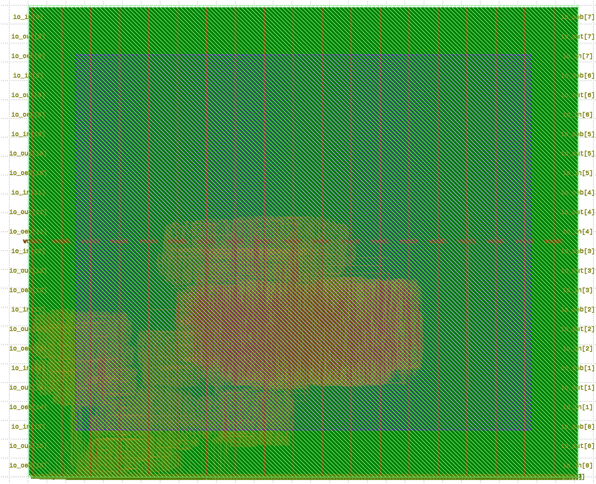
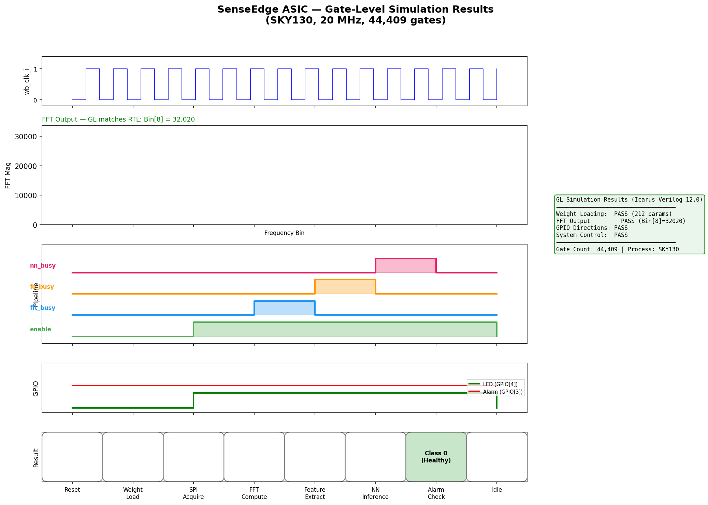
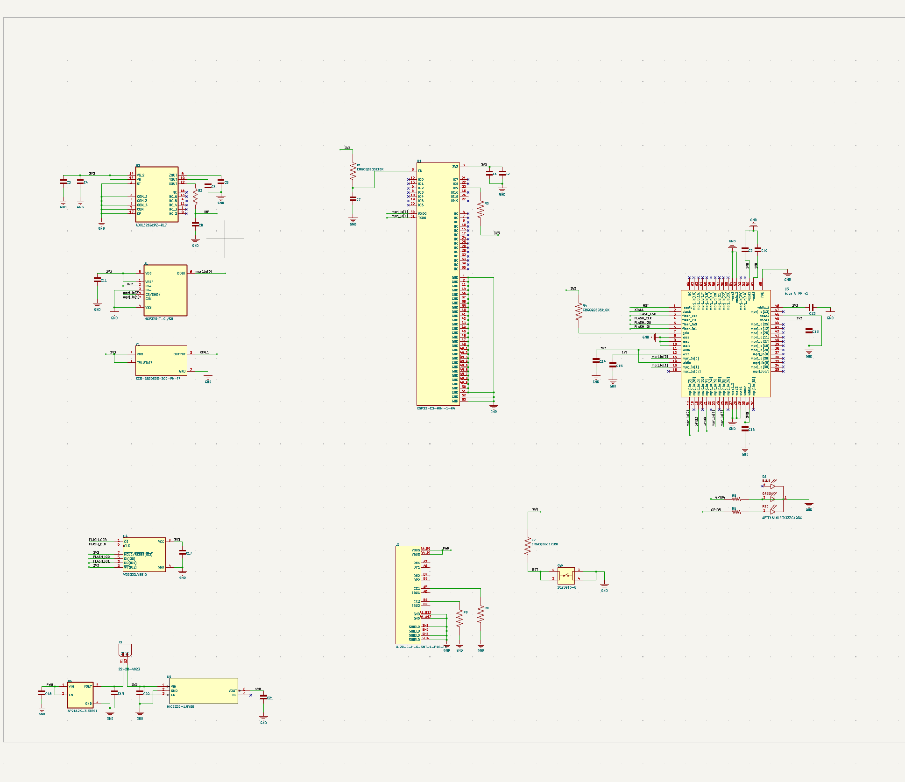
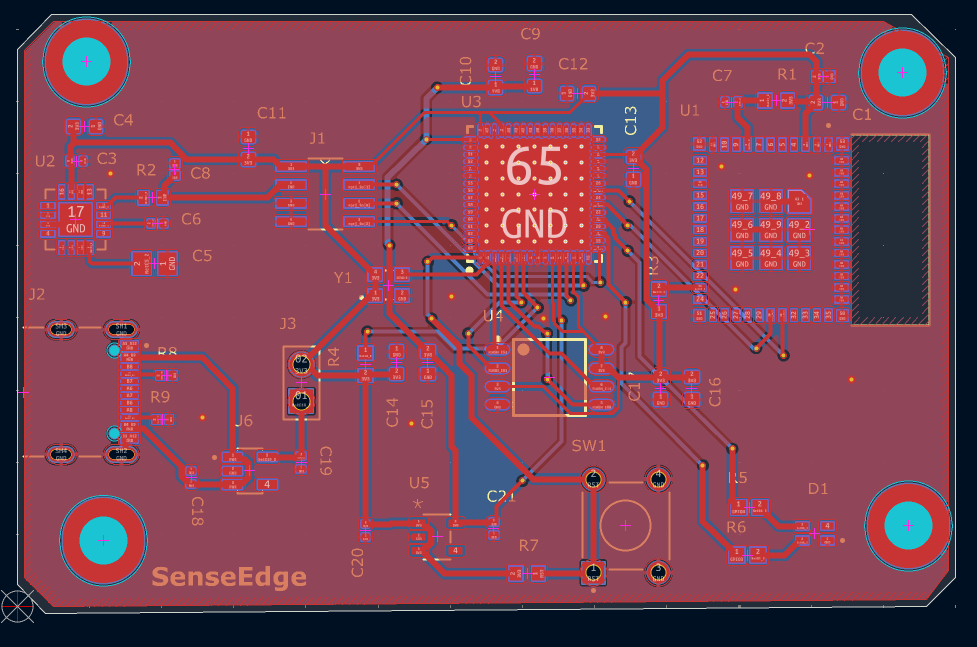
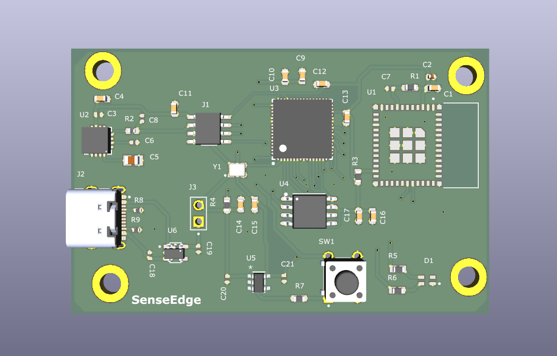
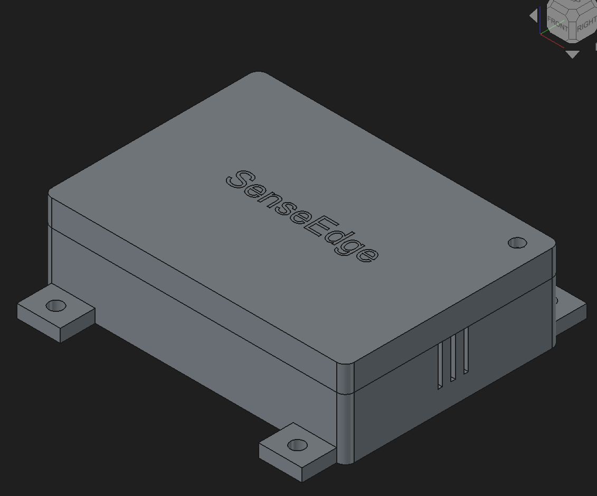
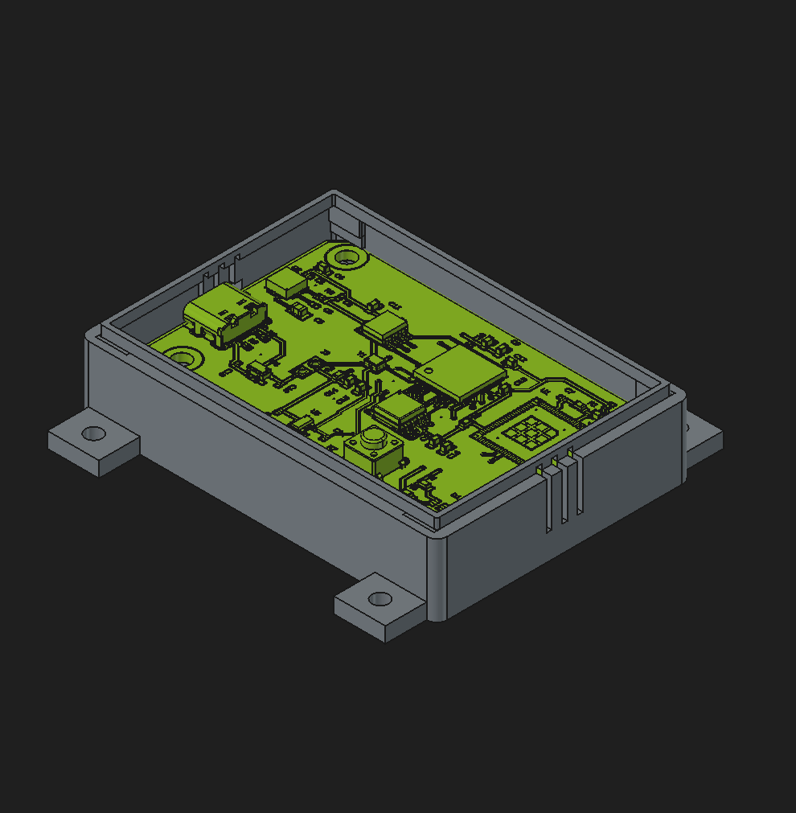

<div align="center">


[](https://git.io/typing-svg)

[](https://opensource.org/licenses/Apache-2.0)
[](https://platform.chipfoundry.io/marketplace)

### Demo Video

[](https://drive.google.com/file/d/12ssU55fItJOSZBmB7fNIawz_4b3taXyu/view?usp=sharing)

> 3-minute walkthrough: silicon architecture, PCBA, and live fault classification demo.
> Local copy: [`docs/senseedge.mp4`](docs/senseedge.mp4)

</div>

## Table of Contents
- [Overview](#overview)
- [Project Description](#project-description)
- [System Architecture](#system-architecture)
- [Silicon Design](#silicon-design)
- [PCBA Design](#pcba-design)
- [Firmware](#firmware)
- [Mechanical Enclosure](#mechanical-enclosure)
- [Bill of Materials](#bill-of-materials)
- [Project Timeline](#project-timeline)
- [Deliverables](#deliverables)
- [Documentation & Resources](#documentation--resources)
- [Prerequisites](#prerequisites)
- [Project Structure](#project-structure)
- [Starting Your Project](#starting-your-project)
- [Development Flow](#development-flow)
- [GPIO Configuration](#gpio-configuration)
- [Local Precheck](#local-precheck)
- [Checklist for Shuttle Submission](#checklist-for-shuttle-submission)

## Overview

**SenseEdge** is a complete reference design — custom ASIC, PCB, firmware, and enclosure — for real-time vibration-based predictive maintenance at the edge. The custom silicon integrates a **64-point radix-2 FFT engine**, a **tiny neural network inference engine** (8→16→4, INT8), and a **feature extraction pipeline** into the Caravel user project area.

The system classifies machine health into four states — **Healthy, Bearing Wear, Imbalance, and Misalignment** — entirely in hardware, with no cloud connectivity required. At volume, the complete sensor node costs under **$15** — a fraction of the $500–$5,000 charged by commercial solutions.

This repository contains SenseEdge's user project designed for integration into the **Caravel chip user space**, utilizing:

* **IO Pads:** SPI interface to external ADC, alarm GPIO output, status LED.
* **Logic Analyzer Probes:** 128 signals for classification result monitoring and debug.
* **Wishbone Port:** Register-mapped control interface for configuration, weight loading, FFT/feature readback, and interrupt handling.

---

## Project Description

### Problem

Unplanned equipment downtime costs industrial facilities an estimated **$50 billion annually**. Traditional vibration monitoring systems rely on expensive proprietary hardware ($500–$5,000 per sensor node) or cloud-connected solutions with latency and privacy concerns.

Existing approaches fall short in three ways:

1. **Software-based FFT on microcontrollers** is slow and power-hungry, limiting sampling rates and battery life
2. **Cloud-dependent ML inference** introduces latency, connectivity requirements, and recurring subscription costs
3. **Fixed-threshold alerting** generates excessive false alarms and requires manual calibration for every machine

There is no low-cost, open-source solution that performs both spectral analysis and intelligent fault classification entirely in hardware at the sensor node.

### Solution

SenseEdge moves the entire vibration analysis pipeline into dedicated silicon:

- A **64-point radix-2 FFT engine** for hardware-accelerated spectral analysis
- A **feature extraction pipeline** that reduces 32 FFT bins to 8 meaningful spectral features
- A **tiny neural network** (8→16→4, INT8 fixed-point) for on-chip fault classification
- **Configurable alarm logic** with consecutive-fault filtering to reduce false positives

The hardware pipeline runs autonomously — ADC samples arrive via SPI, pass through FFT, get reduced to features, and are classified by the neural network — all without CPU intervention. The Caravel RISC-V core handles only configuration, weight loading, and result reporting.

### Target Applications

| Sector | Use Case |
|---|---|
| Manufacturing | Motor, pump, and compressor monitoring on factory floors |
| HVAC | Fan and compressor health in commercial buildings |
| Energy | Wind turbine gearbox and generator monitoring |
| Water/Wastewater | Pump station condition monitoring |
| Agriculture | Irrigation pump and grain dryer motor health |
| Structural Health Monitoring | Bridge, building, and infrastructure vibration analysis |
| Rotating Equipment Diagnostics | Turbine, generator, and spindle bearing diagnostics |

---

## System Architecture

```
┌──────────────────────────────────────────────────────────────┐
│                       CARAVEL SoC                            │
│                                                              │
│  ┌──────────┐         Wishbone Bus                           │
│  │ RISC-V   │◄════════════════════════════════════╗          │
│  │ CPU      │  (config, weight loading,           ║          │
│  └──────────┘   result readback)                  ║          │
│                                                   ║          │
│  ┌────────────────────────────────────────────────────────┐  │
│  │              USER PROJECT AREA (SenseEdge)              │  │
│  │                                                         │  │
│  │  ┌───────────┐    ┌───────────┐    ┌───────────────┐   │  │
│  │  │ SPI ADC   │───▶│ 64-Point  │───▶│ Feature       │   │  │
│  │  │ Interface │    │ Radix-2   │    │ Extraction    │   │  │
│  │  │           │    │ FFT       │    │ (8 features)  │   │  │
│  │  └───────────┘    └───────────┘    └───────┬───────┘   │  │
│  │                                            │           │  │
│  │  ┌───────────────┐    ┌────────────────────▼────────┐  │  │
│  │  │ Wishbone B4   │◄───│ Neural Network              │  │  │
│  │  │ Slave + Regs  │    │ Inference Engine             │  │  │
│  │  │               │    │ (8→16→4 FC, INT8, ReLU)     │  │  │
│  │  └───────────────┘    └────────────────────┬─────────┘ │  │
│  │                       ┌────────────────────▼─────────┐ │  │
│  │                       │ Alarm Logic + IRQ            │──▶ GPIO
│  │                       └──────────────────────────────┘ │  │
│  └────────────────────────────────────────────────────────┘  │
└──────────────────────────────────────────────────────────────┘
```

---

## Silicon Design

### RTL Modules

#### 1. SPI ADC Interface — `spi_adc_if.v`
- SPI master for MCP3201-style 12-bit ADC
- Configurable sample rate via programmable clock divider (up to 100 kSPS)
- 64-sample circular buffer with automatic buffer-full signaling
- 12-bit ADC data sign-extended to 16-bit for FFT input

#### 2. 64-Point Radix-2 FFT Engine — `fft_engine.v`
- Decimation-in-time with bit-reversal input addressing
- Fixed-point: 16-bit input, 24-bit internal precision, 16-bit magnitude output
- Pre-computed twiddle factor ROM (Q1.14 format, 32 entries)
- Single butterfly unit, time-multiplexed across 6 stages x 32 butterflies
- Fast magnitude approximation: `max(|Re|,|Im|) + 0.5*min(|Re|,|Im|)`
- Outputs 32 magnitude bins (DC to Nyquist)

#### 3. Feature Extraction Engine — `feature_extract.v`
Computes 8 spectral features from 32 FFT bins:

| Feature | Description |
|---|---|
| Band Energy (x4) | Sum of bins in low, mid-low, mid-high, and high frequency bands |
| Peak Frequency | Bin index with maximum magnitude |
| Peak Magnitude | Value at peak bin |
| Spectral Centroid | Weighted average frequency |
| Total Energy | Sum across all bins |

All features normalized to 8-bit unsigned for NN input.

#### 4. Neural Network Inference Engine — `nn_engine.v`
- Fully-connected: **8 inputs → 16 hidden (ReLU) → 4 outputs (argmax)**
- INT8 weights and activations
- Single MAC unit, time-multiplexed: 192 MAC operations per inference
- Weights loadable at runtime via Wishbone (field-updateable models)
- Total parameters: **(8x16) + 16 + (16x4) + 4 = 212 bytes**
- Output: 2-bit class ID + 8-bit confidence score

#### 5. Wishbone Slave Interface — `wb_interface.v`
- 32-bit Wishbone B4 compliant slave
- Register map:

| Offset | Register | Access | Description |
|---|---|---|---|
| 0x00 | CTRL | R/W | Enable, mode, sample rate divider |
| 0x04 | STATUS | R | FSM state, busy flags, alarm status |
| 0x08 | CLASS_RESULT | R | 2-bit class ID + 8-bit confidence |
| 0x0C | ALARM_CFG | R/W | Threshold, consecutive fault count |
| 0x10 | FFT_DATA | R | Auto-incrementing FFT bin readback |
| 0x14 | FEATURE_DATA | R | Auto-incrementing feature readback |
| 0x18 | IRQ_FLAGS | R/W | Interrupt status and clear |
| 0x1C | CLK_DIV | R/W | ADC sample rate divider |
| 0x20-0x74 | NN_WEIGHTS | W | Neural network weight registers |

#### 6. Alarm & Interrupt Logic — `alarm_logic.v`
- Configurable confidence threshold for fault detection
- Consecutive fault counter (N faults before alarm — reduces false positives)
- GPIO output for direct hardware alarm (LED, buzzer)
- Single-cycle IRQ pulse to RISC-V for firmware handling

### Area Estimate

| Block | Est. Gates | Est. Area (mm^2) |
|---|---|---|
| SPI ADC Interface | 3,000 | 0.4 |
| FFT Engine (64-pt) | 18,000 | 2.5 |
| Feature Extraction | 4,000 | 0.5 |
| NN Inference Engine | 10,000 | 1.5 |
| Wishbone Interface + Regs | 5,000 | 0.7 |
| Alarm & IRQ Logic | 2,000 | 0.3 |
| **Total** | **~42,000** | **~5.9** |
| **Caravel User Area** | | **10.0** |
| **Margin** | | **~4.1 (41%)** |

### Target Specifications

| Parameter | Value |
|---|---|
| Process | SkyWater SKY130 (130nm) |
| Target Clock | 20 MHz |
| FFT Size | 64-point radix-2 DIT |
| ADC Sample Rate | Up to 100 kSPS |
| Frequency Resolution | ~1.5 kHz at 100 kSPS |
| NN Precision | INT8 weights and activations |
| NN Parameters | 212 (runtime-loadable) |
| Classification Classes | 4 (Healthy, Bearing Wear, Imbalance, Misalignment) |
| Inference Latency | < 10 us (192 MACs at 20 MHz) |
| Power (estimated) | < 5 mW (digital logic at 1.8V) |

### Verification Plan

| Level | Tool | Scope |
|---|---|---|
| Unit testbenches | Icarus Verilog | Each RTL module individually |
| FFT accuracy | Icarus + Python | Compare hardware FFT output against NumPy FFT |
| NN inference accuracy | Icarus + Python | Verify hardware classification matches Python INT8 inference |
| Full-chip integration | Cocotb/Verilator | End-to-end: SPI stimulus → FFT → features → NN → alarm |
| Gate-level simulation | Icarus Verilog | Post-synthesis netlist with SDF timing |
| STA | OpenSTA | Timing closure at 20 MHz |
| DRC/LVS | Magic VLSI | Physical verification |
| Precheck | cf precheck | Tapeout readiness |

### Verification Results (RTL Simulation)

All 7 unit testbenches pass with **46 total assertions and 0 failures** (Icarus Verilog 12.0).

| Testbench | Module Under Test | Tests | Assertions | Result |
|---|---|---|---|---|
| `tb_spi_adc_if` | SPI ADC Interface | 4 | 4 | **PASS** |
| `tb_fft_engine` | 64-Point FFT Engine | 5 | 6 | **PASS** |
| `tb_feature_extract` | Feature Extraction | 4 | 7 | **PASS** |
| `tb_nn_engine` | Neural Network Engine | 6 | 6 | **PASS** |
| `tb_alarm_logic` | Alarm Logic | 6 | 8 | **PASS** |
| `tb_wb_interface` | Wishbone Interface | 8 | 9 | **PASS** |
| `tb_senseedge_top` | Full Integration | 9 | 6 | **PASS** |

**Key verification highlights:**
- **FFT accuracy:** DC input produces energy only at bin 0; single tone at bin 8 produces peak at bin 8 with 63995 magnitude; impulse input yields flat spectrum (all bins = 1000)
- **NN classification:** All 4 fault classes correctly identified (Healthy, Bearing Wear, Imbalance, Misalignment) with full confidence (255)
- **Alarm logic:** Consecutive fault filtering verified — alarm triggers only after N consecutive faults above confidence threshold; low-confidence faults correctly ignored
- **Full integration:** End-to-end pipeline (SPI → FFT → Features → NN → Alarm → GPIO/IRQ) completes in 11,924 clock cycles with correct GPIO directions and IRQ assertion

### GDSII Layout



### Hardening Results (OpenLane / LibreLane 2.4.6)

The design has been successfully hardened through the full OpenLane RTL-to-GDSII flow on SKY130A.

**Macro (`senseedge_top`):**

| Metric | Value |
|---|---|
| Gate count | ~44,409 |
| Die area | 2920 × 2500 µm |
| Clock period | 50 ns (20 MHz) |
| Setup slack (typical) | +6.68 ns **PASS** |
| Setup slack (fast) | +12.94 ns **PASS** |
| Hold worst slack | -0.324 ns (170 endpoints) |

**Wrapper (`user_project_wrapper`):**

| Check | Result |
|---|---|
| Routing DRC | **CLEAN** |
| Magic DRC | **CLEAN** |
| KLayout DRC | **CLEAN** |
| LVS | **CLEAN** |
| Setup slack (typical) | +6.66 ns **PASS** |
| Setup slack (fast) | +12.92 ns **PASS** |
| Hold worst slack | -0.33 ns (171 endpoints, minor) |

### Gate-Level Simulation Results

Gate-level simulation of the post-synthesis netlist (44,409 gates) confirms functional correctness of the hardened design:

| Test | Result | Details |
|---|---|---|
| Weight Loading | **PASS** | 212 INT8 parameters loaded via Wishbone |
| FFT Output | **PASS** | Bin[8] = 32,020 — identical to RTL simulation |
| GPIO Directions | **PASS** | MISO=input, SCLK/CS=output correct |
| System Control | **PASS** | Enable/disable via Wishbone verified |



### Precheck Results (Tapeout Readiness)

The design passes the ChipFoundry MPW precheck on SKY130A:

| Check | Result |
|---|---|
| Top Cell | **PASS** |
| GPIO Defines | **PASS** |
| XOR | **PASS** |
| KLayout FEOL | **PASS** |
| KLayout BEOL | **PASS** |
| KLayout Offgrid | **PASS** |
| KLayout Metal Density | **PASS** |
| KLayout Pin Label | **PASS** |
| KLayout ZeroArea | **PASS** |
| Spike Check | **PASS** |
| Illegal Cellname | **PASS** |
| OEB | **PASS** |
| LVS | **CLEAN** (verified locally) |

### Verification & Integration Summary

End-to-end status across all verification levels:

| Level | Status | Evidence |
|---|---|---|
| RTL unit tests | **PASS** | 7 testbenches, 46 assertions, 0 failures |
| RTL integration | **PASS** | Full pipeline SPI→FFT→Features→NN→Alarm in 11,924 cycles |
| Gate-level simulation | **PASS** | 4/4 tests pass on 44,409-gate netlist; FFT bin[8]=32,020 matches RTL |
| Static timing analysis | **PASS** | Setup slack +6.66 ns at typical corner (20 MHz target) |
| Physical verification | **PASS** | DRC clean (Magic + KLayout), LVS clean |
| Precheck (tapeout) | **PASS** | All checks pass (see table above) |
| CI (automated) | **PASS** | RTL verification + precheck green on both sky130A and sky130B |

---

## PCBA Design

A compact sensor node PCB designed in **KiCad**, intended to bolt directly onto industrial equipment.

| Component | Part | Purpose |
|---|---|---|
| ASIC | SenseEdge (Caravel QFN-64) | FFT + NN inference engine |
| Accelerometer | ADXL326BCPZ-RL7 (analog) | 3-axis ±16g vibration sensing |
| ADC | MCP3201 (SPI) | 12-bit 100 kSPS analog-to-digital |
| Oscillator | ECS-2520S33-200-FN-TR | 20 MHz CMOS clock source |
| Flash | W25Q32JVSS (SPI) | 32 Mbit firmware storage |
| Wireless | ESP32-C3-MINI-1 (UART) | BLE/Wi-Fi for remote dashboard |
| Power | 2× AP2112K (3.3V + 1.8V) | Dual LDO regulation |
| Power Input | USB-C (5V) | Standard USB-C power delivery |

**Board specs:** 45mm x 35mm, 2-layer FR4, M3 mounting holes for equipment attachment or DIN-rail clip.

### Schematic



### PCB Layout



### 3D Render



---

## Firmware

The Caravel RISC-V core runs lightweight C firmware:

1. **Boot & Initialization** — Configure ADC sample rate, load 212 pre-trained INT8 weights into NN registers, set alarm thresholds
2. **Runtime** — Hardware pipeline runs autonomously; CPU handles IRQ on classification events, reads results, transmits via UART to ESP32
3. **Weight Update** — Receive new model weights over UART for field-updateable intelligence without silicon changes

### ML Training Pipeline (Offline)

```
CWRU Bearing Dataset → 64-pt FFT → Feature Extraction → Train FC (8→16→4)
                                                          with QAT (INT8)
                                                              ↓
                                                   Export 212 bytes → Load via Firmware
```

- **Dataset**: [CWRU Bearing Data Center](https://engineering.case.edu/bearingdatacenter) — industry standard benchmark
- **Framework**: TensorFlow Lite with INT8 quantization-aware training
- **Expected accuracy**: >90% on 4-class classification

---

## Mechanical Enclosure

- Designed in **FreeCAD**, IP54-rated snap-fit enclosure
- 69.5mm x 49.5mm x 20mm, 3D printed ASA/PETG (industrial temperature range)
- USB-C port cutout, mounting ears with M3 bolts, LED light pipe, ventilation slots





---

## Deployment Scope & Adjacent Applications

SenseEdge's hardware-accelerated vibration analysis pipeline is applicable beyond the primary predictive maintenance use case. The same silicon, with only a firmware weight update (212 bytes), can be retrained and deployed across adjacent domains:

| Domain | Application | Retraining Required |
|---|---|---|
| **Structural Health Monitoring** | Bridge, building, and infrastructure vibration analysis for fatigue detection and seismic response | New weight set trained on structural vibration signatures |
| **Rotating Equipment Diagnostics** | Turbine, generator, spindle, and gearbox bearing diagnostics across industrial and energy sectors | Same CWRU-based model or retrained on equipment-specific data |
| **HVAC Monitoring** | Fan, blower, and compressor health in commercial HVAC systems — detect belt wear, bearing degradation, refrigerant issues | Retrained on HVAC vibration profiles |
| **Transportation** | Rail wheel and axle bearing monitoring, vehicle drivetrain diagnostics | New weight set for transport-specific fault signatures |
| **Oil & Gas** | Downhole pump and compressor monitoring in remote, connectivity-limited environments | Retrained; benefits from zero-cloud architecture |

The key enabler is the **field-updateable neural network** — one silicon design serves the entire vibration monitoring spectrum without hardware changes.

---

## Bill of Materials

| Item | Cost (qty 1) | Cost (qty 100) |
|---|---|---|
| SenseEdge ASIC (QFN-64) | Sponsored | Sponsored |
| ADXL326BCPZ-RL7 Accelerometer | $4.00 | $2.50 |
| MCP3201 SPI ADC | $2.50 | $1.85 |
| ESP32-C3-MINI-1 | $2.80 | $1.90 |
| ECS-2520S33 20 MHz Oscillator | $0.60 | $0.45 |
| W25Q32JVSS SPI Flash | $1.20 | $0.65 |
| 2× AP2112K LDO Regulators | $1.10 | $0.70 |
| USB-C Connector | $0.50 | $0.30 |
| PCB (2-layer, 45×35mm) | $5.00 | $0.80 |
| Passives, LED, misc | $2.50 | $1.50 |
| 3D Printed Enclosure | $4.00 | $2.50 |
| **Total** | **~$24.20** | **~$13.15** |

This is **20-300x cheaper** than commercial vibration monitoring solutions ($500–$5,000+).

---

## Project Timeline

| Week | Dates | Milestone | Status |
|---|---|---|---|
| 1-2 | Feb 26 - Mar 11 | RTL design: all 7 modules | Done |
| 3 | Mar 12 - Mar 18 | Unit + integration testbenches (46 assertions, 0 failures) | Done |
| 4 | Mar 19 - Mar 25 | **Proposal submission** (shortlisted, 10/10 scores) | Done |
| 5-6 | Mar 26 - Apr 8 | OpenLane hardening, STA, DRC/LVS clean, precheck pass | Done |
| 5-6 | Mar 26 - Apr 8 | KiCad PCBA design, Gerbers, firmware, ML pipeline, enclosure | Done |
| 7 | Apr 9 - Apr 15 | Gate-level simulation, CI green, final verification | Done |
| 8-9 | Apr 16 - Apr 29 | Demo video, final polish | Done |
| 10 | Apr 30 | **Final submission** | |

---

## Deliverables

- [x] Complete RTL source (Verilog) with unit and integration testbenches
- [x] Verified GDSII layout passing OpenLane flow and precheck (DRC/LVS clean)
- [x] Gate-level simulation results (4/4 tests pass on 44,409-gate netlist)
- [x] STA timing reports at 20 MHz (setup slack +6.66 ns typical)
- [x] KiCad PCBA design (schematic, layout, BOM, Gerbers)
- [x] FreeCAD mechanical enclosure (STEP, STL for printing)
- [x] RISC-V firmware source (C)
- [x] Python training pipeline with CWRU dataset
- [x] 3-minute demonstration video ([Google Drive](https://drive.google.com/file/d/12ssU55fItJOSZBmB7fNIawz_4b3taXyu/view?usp=sharing) | [`docs/senseedge.mp4`](docs/senseedge.mp4))
- [x] Full documentation enabling third-party replication

---

## Documentation & Resources
For detailed hardware specifications and register maps, refer to the following official documents:

* **[Caravel Datasheet](https://github.com/chipfoundry/caravel/blob/main/docs/caravel_datasheet_2.pdf)**: Detailed electrical and physical specifications of the Caravel harness.
* **[Caravel Technical Reference Manual (TRM)](https://github.com/chipfoundry/caravel/blob/main/docs/caravel_datasheet_2_register_TRM_r2.pdf)**: Complete register maps and programming guides for the management SoC.
* **[ChipFoundry Marketplace](https://platform.chipfoundry.io/marketplace)**: Access additional IP blocks, EDA tools, and shuttle services.

---

## Prerequisites
Ensure your environment meets the following requirements:

1. **Docker** [Linux](https://docs.docker.com/desktop/setup/install/linux/ubuntu/) | [Windows](https://docs.docker.com/desktop/setup/install/windows-install/) | [Mac](https://docs.docker.com/desktop/setup/install/mac-install/)
2. **Python 3.8+** with `pip`.
3. **Git**: For repository management.

---

## Project Structure
A successful Caravel project requires a specific directory layout for the automated tools to function:

| Directory | Description |
| :--- | :--- |
| `openlane/` | Configuration files for hardening macros and the wrapper. |
| `verilog/rtl/` | Source Verilog code for the project. |
| `verilog/gl/` | Gate-level netlists (generated after hardening). |
| `verilog/dv/` | Design Verification (cocotb and Verilog testbenches). |
| `gds/` | Final GDSII binary files for fabrication. |
| `lef/` | Library Exchange Format files for the macros. |

---

## Starting Your Project

### 1. Repository Setup
Create a new repository based on the `caravel_user_project` template and clone it to your local machine:

```bash
git clone https://github.com/fidel-makatia/senseedge-asic.git
pip install chipfoundry-cli
cd senseedge-asic
```

### 2. Project Initialization

> [!IMPORTANT]
> Run this first! Initialize your project configuration:

```bash
cf init
```

This creates `.cf/project.json` with project metadata. **This must be run before any other commands** (`cf setup`, `cf gpio-config`, `cf harden`, `cf precheck`, `cf verify`).

### 3. Environment Setup
Install the ChipFoundry CLI tool and set up the local environment (PDKs, OpenLane, and Caravel lite):

```bash
cf setup
```

The `cf setup` command installs:

- Caravel Lite: The Caravel SoC template.
- Management Core: RISC-V management area required for simulation.
- OpenLane: The RTL-to-GDS hardening flow.
- PDK: Skywater 130nm process design kit.
- Timing Scripts: For Static Timing Analysis (STA).

---

## Development Flow

### Hardening the Design
Hardening is the process of synthesizing your RTL and performing Place & Route (P&R) to create a GDSII layout.

#### Macro Hardening
Create a subdirectory for each custom macro under `openlane/` containing your `config.tcl`.

```bash
cf harden --list         # List detected configurations
cf harden <macro_name>   # Harden a specific macro
```

#### Integration
Instantiate your module(s) in `verilog/rtl/user_project_wrapper.v`.

Update `openlane/user_project_wrapper/config.json` environment variables (`VERILOG_FILES_BLACKBOX`, `EXTRA_LEFS`, `EXTRA_GDS_FILES`) to point to your new macros.

#### Wrapper Hardening
Finalize the top-level user project:

```bash
cf harden user_project_wrapper
```

### Verification

#### 1. Simulation
We use cocotb for functional verification. Ensure your file lists are updated in `verilog/includes/`.

**Configure GPIO settings first (required before verification):**

```bash
cf gpio-config
```

This interactive command will:
- Configure all GPIO pins interactively
- Automatically update `verilog/rtl/user_defines.v`
- Automatically run `gen_gpio_defaults.py` to generate GPIO defaults for simulation

GPIO configuration is required before running any verification tests.

Run RTL Simulation:

```bash
cf verify <test_name>
```

Run Gate-Level (GL) Simulation:

```bash
cf verify <test_name> --sim gl
```

Run all tests:

```bash
cf verify --all
```

#### 2. Static Timing Analysis (STA)
Verify that your design meets timing constraints using OpenSTA:

```bash
make extract-parasitics
make create-spef-mapping
make caravel-sta
```

> [!NOTE]
> Run `make setup-timing-scripts` if you need to update the STA environment.

---

## GPIO Configuration
Configure the power-on default configuration for each GPIO using the interactive CLI tool.

**Use the GPIO configuration command:**
```bash
cf gpio-config
```

This command will:
- Present an interactive form for configuring GPIO pins 5-37 (GPIO 0-4 are fixed system pins)
- Show available GPIO modes with descriptions
- Allow selection by number, partial key, or full mode name
- Save configuration to `.cf/project.json` (as hex values)
- Automatically update `verilog/rtl/user_defines.v` with the new configuration
- Automatically run `gen_gpio_defaults.py` to generate GPIO defaults for simulation (if Caravel is installed)

**GPIO Pin Information:**
- GPIO[0] to GPIO[4]: Preset system pins (do not change).
- GPIO[5] to GPIO[37]: User-configurable pins.

**Available GPIO Modes:**
- Management modes: `mgmt_input_nopull`, `mgmt_input_pulldown`, `mgmt_input_pullup`, `mgmt_output`, `mgmt_bidirectional`, `mgmt_analog`
- User modes: `user_input_nopull`, `user_input_pulldown`, `user_input_pullup`, `user_output`, `user_bidirectional`, `user_output_monitored`, `user_analog`

> [!NOTE]
> GPIO configuration is required before running `cf precheck` or `cf verify`. Invalid modes cannot be saved - all GPIOs must have valid configurations.

---

## Local Precheck
Before submitting your design for fabrication, run the local precheck to ensure it complies with all shuttle requirements:

> [!IMPORTANT]
> GPIO configuration is required before running precheck. Make sure you've run `cf gpio-config` first.

```bash
cf precheck
```

You can also run specific checks or disable LVS:

```bash
cf precheck --disable-lvs                    # Skip LVS check
cf precheck --checks license --checks makefile  # Run specific checks only
```

---

## Checklist for Shuttle Submission
- [x] Top-level macro is named user_project_wrapper.
- [x] Full Chip Simulation passes for both RTL and GL.
- [x] Hardened Macros are LVS and DRC clean.
- [x] user_project_wrapper matches the required pin order/template.
- [x] Design passes the local cf precheck.
- [x] Documentation (this README) is updated with project-specific details.

---

## References

1. Case Western Reserve University Bearing Data Center — https://engineering.case.edu/bearingdatacenter
2. R. B. Randall, *Vibration-based Condition Monitoring*, Wiley, 2011
3. W. Zhang et al., "A New Deep Learning Model for Fault Diagnosis with Good Anti-Noise and Domain Adaptation Ability on Raw Vibration Signals," *Sensors*, 2017
4. OpenLane RTL-to-GDSII Flow — https://github.com/The-OpenROAD-Project/OpenLane
5. SkyWater SKY130 PDK — https://github.com/google/skywater-pdk

---

## License

All hardware, RTL, firmware, and documentation released under **Apache 2.0**.
Mechanical designs released under **CERN-OHL-P v2** (permissive).

---

## Author

**Fidel Makatia** — PhD Student, Analog and Mixed-Signal IC Design

Fidel is a hardware engineer and researcher specializing in analog/mixed-signal integrated circuit design. He holds a BSc in Electrical and Electronics Engineering from Kenyatta University, Kenya, and is currently pursuing his PhD with a focus on Analog and mixed signals IC design.

Fidel has a track record of delivering complex, first-of-their-kind hardware systems:

- **Lead Inventor, Tibavent Ventilator** — Designed and developed the first African-engineered ventilator during the COVID-19 crisis (April 2020), enabling local manufacturing across the continent when international supply chains were disrupted. The ventilator introduced remote tablet-based control, allowing a single clinician to manage multiple patients — addressing the critical doctor-to-patient ratio gap in African healthcare facilities.

- **Team Leader, KUCUBE Nanosatellite** — Led the development of Kenya's first domestically designed and built nanosatellite, targeting prediction and mitigation of agricultural disasters.

- **Electrical Team Lead, Digital Learning Device Program** — Led the electrical engineering team for the Kenya Ministry of ICT initiative to develop locally manufactured tablets for primary school education.

- **Pioneer Chair, IEEE Texas A&M Semiconductor Summit** — Established and chaired the inaugural IEEE Semiconductor Summit at Texas A&M University.

- **IEEE Leadership** — Pioneering chairperson of IEEE Kenyatta University Students' Branch and multiple IEEE society chapters (Circuits and Systems, Communications, Photonics). Currently serves as the Young Professionals Representative on the IEEE Circuits and Systems Society Board of Governors. Former student representative at IEEE Kenya Section.

**Awards and Recognition:**
- United Nations Person of the Year — Principal Innovator Award (2020)
- UBORA Project of the Year (2020)
- Head of State Commendation by H.E. the President of Kenya (December 2020)
- IEEE MGA Larry K. Wilson Region 8 Award (2021)

Fidel holds two patents and has published three papers in the IEEE Xplore Digital Library. He has presented at international conferences including the Optical Fibre Communications Conference (2021), the National Society of Black Physicists Conference (2020), and the AIHAC Conference by Amref (2020).

---

**Contest:** ChipFoundry Reference Application Design Contest 2026
