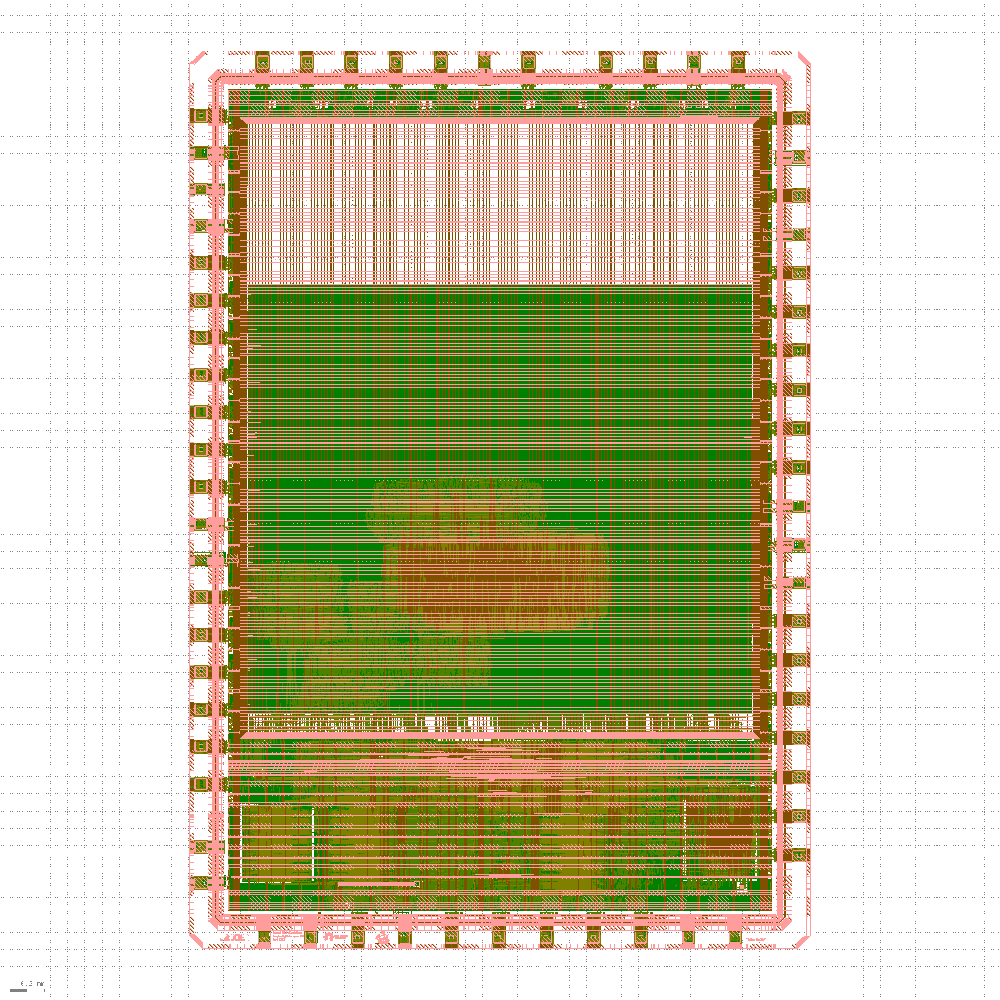

# 🚀 ChipFoundry Tapeout Report

**Consolidated Tapeout and DRC Report**

*Custom Chip Design and Fabrication Platform*

**Generated:** 2026-05-29 17:13:21

## Project Information

| Field | Value |
|-------|-------|
| Project Path | `/mnt/shuttle/ci2605/fidel-omusilibwa/SenseEdge` |
| Project Name | **SenseEdge** |
| User | fidel-omusilibwa |
| Project ID | 2605c0e9 |
| Project Type | digital |
| Slot | 26 |
| Version | 3 |

## Tapeout Status

| Field | Value |
|-------|-------|
| Status | **COMPLETED** |
| Shuttle | ci2605 |
| PDK | sky130A |
| PDK Version | unknown |
| PDK Short Hash | unknown |
| PDK Tag | unknown |
| Caravel Version | CC2509 |
| Caravel Commit Hash | a0b50ad |
| Target Foundry | skywater |
| Run Tapeout Version | 1.9.7 |
| KLayout Version | 0.30.2 |
| Magic Version | 8.3.471 |
| DRC Input File | `gds/caravel_2605c0e9.gds` |
| DRC Top Cell | `caravel_2605c0e9` |
| OAS Output File | `tapeout/outputs/oas/caravel_2605c0e9.oas` |

## GPIO Configuration

This section shows the GPIO configuration for your project based on layout analysis and RTL definitions.

**Note:** GPIO 0-4 have fixed configurations and are not user-configurable. GPIO 5-37 can be configured to either user or management areas.

### GPIO Mode Reference

#### Management Area Modes
- `0403`: Input, no pull-up/down
- `0c01`: Input with pull-down
- `0801`: Input with pull-up
- `1809`: Output
- `1801`: Bidirectional
- `000b`: Analog

#### User Area Modes
- `0402`: Input, no pull-up/down
- `0c00`: Input with pull-down
- `0800`: Input with pull-up
- `1808`: Output
- `1800`: Bidirectional
- `1802`: Output with monitoring
- `000a`: Analog

### GPIO Configuration Details

| GPIO | Layout Config | Layout Mode | RTL Config | RTL Mode | Status |
|------|---------------|-------------|------------|----------|--------|
| GPIO_5 | `1809` | GPIO_MODE_MGMT_STD_OUTPUT | `1809` | GPIO_MODE_MGMT_STD_OUTPUT | ✅ Matches |
| GPIO_6 | `0403` | GPIO_MODE_MGMT_STD_INPUT_NOPULL | `0403` | GPIO_MODE_MGMT_STD_INPUT_NOPULL | ✅ Matches |
| GPIO_7 | `0403` | GPIO_MODE_MGMT_STD_INPUT_NOPULL | `0403` | GPIO_MODE_MGMT_STD_INPUT_NOPULL | ✅ Matches |
| GPIO_8 | `0403` | GPIO_MODE_MGMT_STD_INPUT_NOPULL | `0403` | GPIO_MODE_MGMT_STD_INPUT_NOPULL | ✅ Matches |
| GPIO_9 | `0403` | GPIO_MODE_MGMT_STD_INPUT_NOPULL | `0403` | GPIO_MODE_MGMT_STD_INPUT_NOPULL | ✅ Matches |
| GPIO_10 | `0403` | GPIO_MODE_MGMT_STD_INPUT_NOPULL | `0403` | GPIO_MODE_MGMT_STD_INPUT_NOPULL | ✅ Matches |
| GPIO_11 | `0403` | GPIO_MODE_MGMT_STD_INPUT_NOPULL | `0403` | GPIO_MODE_MGMT_STD_INPUT_NOPULL | ✅ Matches |
| GPIO_12 | `0403` | GPIO_MODE_MGMT_STD_INPUT_NOPULL | `0403` | GPIO_MODE_MGMT_STD_INPUT_NOPULL | ✅ Matches |
| GPIO_13 | `0403` | GPIO_MODE_MGMT_STD_INPUT_NOPULL | `0403` | GPIO_MODE_MGMT_STD_INPUT_NOPULL | ✅ Matches |
| GPIO_14 | `0403` | GPIO_MODE_MGMT_STD_INPUT_NOPULL | `0403` | GPIO_MODE_MGMT_STD_INPUT_NOPULL | ✅ Matches |
| GPIO_15 | `0403` | GPIO_MODE_MGMT_STD_INPUT_NOPULL | `0403` | GPIO_MODE_MGMT_STD_INPUT_NOPULL | ✅ Matches |
| GPIO_16 | `0403` | GPIO_MODE_MGMT_STD_INPUT_NOPULL | `0403` | GPIO_MODE_MGMT_STD_INPUT_NOPULL | ✅ Matches |
| GPIO_17 | `0403` | GPIO_MODE_MGMT_STD_INPUT_NOPULL | `0403` | GPIO_MODE_MGMT_STD_INPUT_NOPULL | ✅ Matches |
| GPIO_18 | `0403` | GPIO_MODE_MGMT_STD_INPUT_NOPULL | `0403` | GPIO_MODE_MGMT_STD_INPUT_NOPULL | ✅ Matches |
| GPIO_19 | `0403` | GPIO_MODE_MGMT_STD_INPUT_NOPULL | `0403` | GPIO_MODE_MGMT_STD_INPUT_NOPULL | ✅ Matches |
| GPIO_20 | `0403` | GPIO_MODE_MGMT_STD_INPUT_NOPULL | `0403` | GPIO_MODE_MGMT_STD_INPUT_NOPULL | ✅ Matches |
| GPIO_21 | `0403` | GPIO_MODE_MGMT_STD_INPUT_NOPULL | `0403` | GPIO_MODE_MGMT_STD_INPUT_NOPULL | ✅ Matches |
| GPIO_22 | `0403` | GPIO_MODE_MGMT_STD_INPUT_NOPULL | `0403` | GPIO_MODE_MGMT_STD_INPUT_NOPULL | ✅ Matches |
| GPIO_23 | `0403` | GPIO_MODE_MGMT_STD_INPUT_NOPULL | `0403` | GPIO_MODE_MGMT_STD_INPUT_NOPULL | ✅ Matches |
| GPIO_24 | `0403` | GPIO_MODE_MGMT_STD_INPUT_NOPULL | `0403` | GPIO_MODE_MGMT_STD_INPUT_NOPULL | ✅ Matches |
| GPIO_25 | `0403` | GPIO_MODE_MGMT_STD_INPUT_NOPULL | `0403` | GPIO_MODE_MGMT_STD_INPUT_NOPULL | ✅ Matches |
| GPIO_26 | `0403` | GPIO_MODE_MGMT_STD_INPUT_NOPULL | `0403` | GPIO_MODE_MGMT_STD_INPUT_NOPULL | ✅ Matches |
| GPIO_27 | `0403` | GPIO_MODE_MGMT_STD_INPUT_NOPULL | `0403` | GPIO_MODE_MGMT_STD_INPUT_NOPULL | ✅ Matches |
| GPIO_28 | `0403` | GPIO_MODE_MGMT_STD_INPUT_NOPULL | `0403` | GPIO_MODE_MGMT_STD_INPUT_NOPULL | ✅ Matches |
| GPIO_29 | `0403` | GPIO_MODE_MGMT_STD_INPUT_NOPULL | `0403` | GPIO_MODE_MGMT_STD_INPUT_NOPULL | ✅ Matches |
| GPIO_30 | `0403` | GPIO_MODE_MGMT_STD_INPUT_NOPULL | `0403` | GPIO_MODE_MGMT_STD_INPUT_NOPULL | ✅ Matches |
| GPIO_31 | `0403` | GPIO_MODE_MGMT_STD_INPUT_NOPULL | `0403` | GPIO_MODE_MGMT_STD_INPUT_NOPULL | ✅ Matches |
| GPIO_32 | `0403` | GPIO_MODE_MGMT_STD_INPUT_NOPULL | `0403` | GPIO_MODE_MGMT_STD_INPUT_NOPULL | ✅ Matches |
| GPIO_33 | `0403` | GPIO_MODE_MGMT_STD_INPUT_NOPULL | `0403` | GPIO_MODE_MGMT_STD_INPUT_NOPULL | ✅ Matches |
| GPIO_34 | `0403` | GPIO_MODE_MGMT_STD_INPUT_NOPULL | `0403` | GPIO_MODE_MGMT_STD_INPUT_NOPULL | ✅ Matches |
| GPIO_35 | `0403` | GPIO_MODE_MGMT_STD_INPUT_NOPULL | `0403` | GPIO_MODE_MGMT_STD_INPUT_NOPULL | ✅ Matches |
| GPIO_36 | `0403` | GPIO_MODE_MGMT_STD_INPUT_NOPULL | `0403` | GPIO_MODE_MGMT_STD_INPUT_NOPULL | ✅ Matches |
| GPIO_37 | `0403` | GPIO_MODE_MGMT_STD_INPUT_NOPULL | `0403` | GPIO_MODE_MGMT_STD_INPUT_NOPULL | ✅ Matches |

**Legend:**
- **Layout:** GPIO configuration extracted from layout (GPIO defaults blocks)
- **RTL:** GPIO configuration from user_defines.v file
- **Status:** Comparison result between layout and RTL

*This configuration is based on the user_defines.v file from the caravel_user_project template repository.*

#### User Wrapper GDS

| Property | Value |
|----------|-------|
| File | `user_project_wrapper.gds` |
| Size | 231.56 MB |
| Modified | 2026-05-29T02:40:18.970000 |
| Stored Hash | `977b2821cb0d61d5615b32bef7d174deacf8739026933d36584c72c34811d494` |
| Current Hash | `977b2821cb0d61d5615b32bef7d174deacf8739026933d36584c72c34811d494` |
| Hash Valid | ✅ |

#### OASIS File

| Property | Value |
|----------|-------|
| File | `caravel_2605c0e9.oas` |
| Size | 40.09 MB |
| Modified | 2026-05-29T06:25:14.127000 |
| Current Hash | `bf98b2a8326ac309d0ff369d4901db040c74bb5739d786ca1f0181e461afb272` |
| Stored Hash | `bf98b2a8326ac309d0ff369d4901db040c74bb5739d786ca1f0181e461afb272` |
| Hash Valid | ✅ |

#### OASIS Layout Images

Generated layout images from OASIS files showing the chip design visualization.

**caravel_layout**

| Property | Value |
|----------|-------|
| File | `caravel_layout.png` |
| Size | 0.36 MB |
| Modified | 2026-05-29 06:25:39 |
| Format | PNG |

*Images are generated from OASIS files using GDSFactory for high-quality visualization.*

## DRC Results Summary

| Metric | Value |
|--------|-------|
| Total Checks | **26** |
| Passed | 26 |
| Failed | 0 |
| Total Errors | 0 |
| Total Execution Time | 255.22 minutes |
| Last Updated | 2026-05-29T17:13:19.726608 |

## Information Checks

These checks provide information about design features:

| Check Name | Status | Execution Time | Last Updated | Report File |
|------------|--------|----------------|--------------|-------------|
| Commercial SRAM (`cs`) | ⚫ NO | 0.76 min | 2026-05-29T17:13:19.726547 | `../outputs/klayout_CF_SRAM_check.xml` |
| RRAM Layers (`rr`) | ⚫ NO | 0.42 min | 2026-05-29T17:13:19.726581 | `../outputs/klayout_rram_layers_check.xml` |
| OpenRAM (`os`) | ⚫ NO | 0.43 min | 2026-05-29T17:13:19.726585 | `../outputs/klayout_open_sram_check.xml` |

## DRC Validation Checks

These checks validate design rules and constraints:

| Check Name | Status | Errors | Execution Time | Last Updated | Report File |
|------------|--------|--------|----------------|--------------|-------------|
| Backend (`be`) | ✅ PASS | 0 | 72.23 min | 2026-05-29T17:13:19.726491 | `../outputs/klayout_beol_check.xml` |
| Frontend (`fe`) | ✅ PASS | 0 | 38.77 min | 2026-05-29T17:13:19.726472 | `../outputs/klayout_feol_check.xml` |
| Off-Grid (`og`) | ✅ PASS | 0 | 25.75 min | 2026-05-29T17:13:19.726535 | `../outputs/klayout_grid_check.xml` |
| Metal Global Density (`md`) | ✅ PASS | 0 | 22.41 min | 2026-05-29T17:13:19.726505 | `../outputs/klayout_mgld_check.xml` |
| Unknown Layers (`ul`) | ✅ PASS | 0 | 20.13 min | 2026-05-29T17:13:19.726566 | `../outputs/klayout_unknown_layers_check.xml` |
| Metal 1 Drawn vs Fill (`m1`) | ✅ PASS | 0 | 17.42 min | 2026-05-29T17:13:19.726513 | `../outputs/klayout_metal1_drawn_vs_fill_check.xml` |
| Metal 4 Drawn vs Fill (`m4`) | ✅ PASS | 0 | 14.03 min | 2026-05-29T17:13:19.726527 | `../outputs/klayout_metal4_drawn_vs_fill_check.xml` |
| Metal 2 Drawn vs Fill (`m2`) | ✅ PASS | 0 | 12.31 min | 2026-05-29T17:13:19.726518 | `../outputs/klayout_metal2_drawn_vs_fill_check.xml` |
| Metal 3 Drawn vs Fill (`m3`) | ✅ PASS | 0 | 10.26 min | 2026-05-29T17:13:19.726522 | `../outputs/klayout_metal3_drawn_vs_fill_check.xml` |
| Metal Tiled Density (`mt`) | ✅ PASS | 0 | 4.20 min | 2026-05-29T17:13:19.726509 | `../outputs/klayout_metd_check.xml` |
| FOM LI Overlap (`fl`) | ✅ PASS | 0 | 2.99 min | 2026-05-29T17:13:19.726531 | `../outputs/klayout_foml_check.xml` |
| Special Created Layers (`cl`) | ✅ PASS | 0 | 2.93 min | 2026-05-29T17:13:19.726604 | `../outputs/klayout_special_cl_check.xml` |
| Boundary Check (`bc`) | ✅ PASS | 0 | 2.07 min | 2026-05-29T17:13:19.726608 | `../outputs/klayout_boundary_check.xml` |
| Missing Cells (`mc`) | ✅ PASS | 0 | 1.96 min | 2026-05-29T17:13:19.726562 | `../outputs/klayout_missing_cells_check.xml` |
| FOM1 (700x700) (`f1`) | ✅ PASS | 0 | 1.63 min | 2026-05-29T17:13:19.726555 | `../outputs/klayout_fom_density_700_check.xml` |
| FOM2 (2000x2000) (`f2`) | ✅ PASS | 0 | 1.61 min | 2026-05-29T17:13:19.726559 | `../outputs/klayout_fom_density_2000_check.xml` |
| Spike Check (`sp`) | ✅ PASS | 0 | 0.78 min | 2026-05-29T17:13:19.726543 | `../outputs/klayout_spike_check.xml` |
| Poly Density (`pd`) | ✅ PASS | 0 | 0.78 min | 2026-05-29T17:13:19.726501 | `../outputs/klayout_poly_check.xml` |
| id (`id`) | ✅ PASS | 0 | 0.47 min | 2026-05-29T17:13:19.726589 | `../outputs/klayout_id_check.xml` |
| GPIO Check (`gp`) | ✅ PASS | 0 | 0.47 min | 2026-05-29T17:13:19.726593 | `../outputs/klayout_gp_check.xml` |
| Illegal Character (`ic`) | ✅ PASS | 0 | 0.42 min | 2026-05-29T17:13:19.726577 | `../outputs/klayout_illegal_char_check.xml` |
| Big FOM Density Delta (`bd`) | ✅ PASS | 0 | 0.00 min | 2026-05-29T17:13:19.726570 | No report |
| Little FOM Density Delta (`ld`) | ✅ PASS | 0 | 0.00 min | 2026-05-29T17:13:19.726574 | No report |

---

## 🏢 About ChipFoundry

**ChipFoundry** is a leading platform for advanced chip design and verification, providing comprehensive tools and services for the semiconductor industry.

### 🌐 Resources
- **Website:** [https://chipfoundry.io](https://chipfoundry.io)
- **Documentation:** [https://chipfoundry.io/docs](https://chipfoundry.io/docs)
- **Support:** [https://chipfoundry.io/support](https://chipfoundry.io/support)

---
*Report generated by ChipFoundry Tapeout Tools on 2026-05-29 17:13:21*